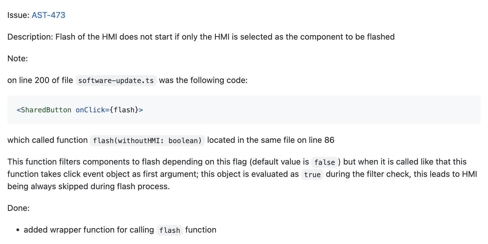
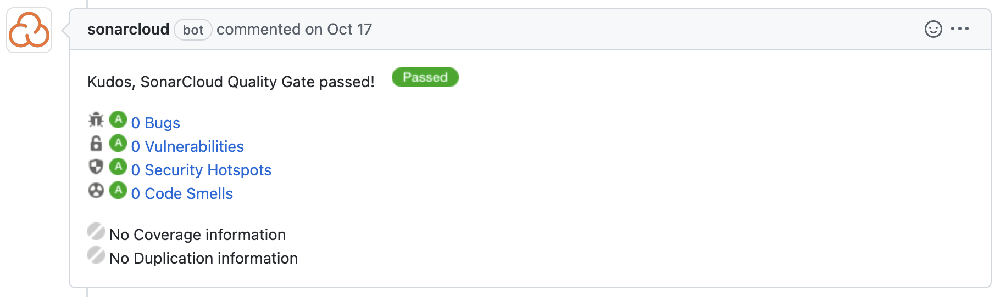

# Best practises: Pull requests
This document describes best practises when dealing with pull requests, that were learned within the amprio project (former We1U team).

## Creation of the pull request
### Name
Set the git commit message as the name of the pull request. When merging this is the suggested name for the commit message, which lets you easily confirm the PR instead of setting a proper git commit message.

#### Examples
- fix: reflash feature issues
- feat: add translation for contact and imprint page

### Description
The following information have to be included in a pull request description:

- Jira issue number and link to it (if available)
- Description of the jira issue 
- What changes are available with this PR (i.e. the actual work done)
- Important information and remarks

#### Examples

### Basic configuration
Nothing specific for this project

### Configuration of bots / checks
Bots used in this project:

- SonarCloud Bot
- Travis CI Bot (Linting and Build have to pass)

### Reviewing and Merging
We have applied the following rules for this project:

- Checkout the branch holding the commits, run and test it locally (especially when hardware related)
- Do not squash commits when merging

**[back to pull requests](/docs/development.md#pull-requests)**