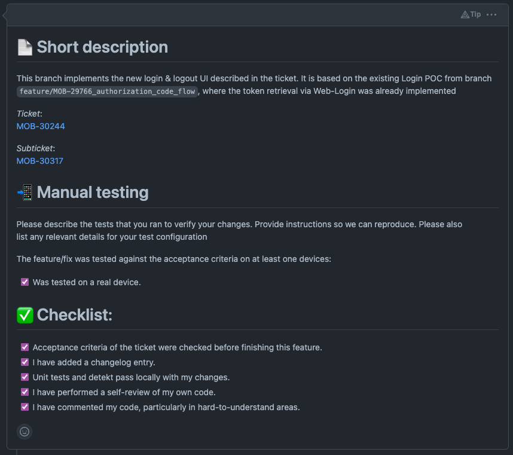
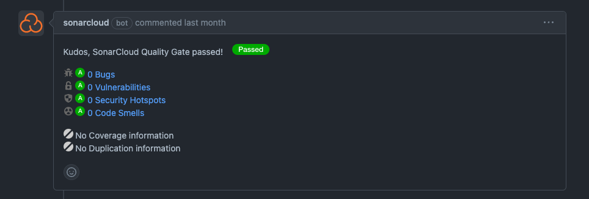
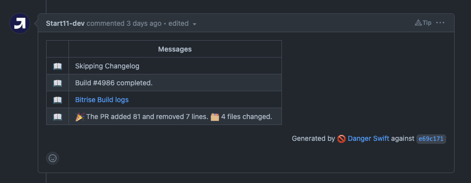

# Best practices: Pull requests
This document describes best practices when dealing with pull requests, that were learned within the Appengers team.

## Creation of the pull request
[PR Template](./pullRequest-appengers-template.md)

### Name
Set the git commit message as the name of the pull request. When merging this is the suggested name for the commit message, which lets you easily confirm the PR instead of setting a proper git commit message. 

#### Examples
- fix: reflash feature issues
- feat: add translation for contact and legal notice page 

### Description
The description is already outlined by our template, which can be found in any of our repositories. Basically it contains all needed information:
- A short description of the PR
- The Jira main and subtask ticket
- What is needed to reproduce the bug respectively the fix or what steps are needed to test the feature 
- A list of devices and simulators the build was tested on 
- A checklist at the end to make sure all necessary steps are done (e.g. changelog entry, unit tests pass, etc.)

#### Examples
 

### Configuration of bots / checks
Checks that have have to pass are Bitrise (the PR check workflow) and Danger on iOS or SonarCloud Bot on Android.

### Reviewing and Merging
We have applied the following rules for this project:
- Checkout the branch holding the commits
- run and test it locally, make sure to run the unit tests locally, too
- Do not squash commits when merging

**[back to pull requests](/docs/development.md#pull-requests)**
