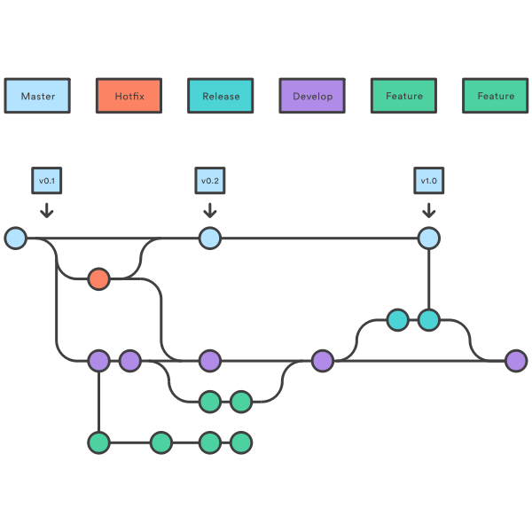

# NanoGiants Docs - Developmnent 
<!-- section: Introduction -->
<!-- Describe what this document refers to. At what target audience is it aimed? -->

This section describes how we develop software at NanoGiants

## Table of contents
<!-- section: Table of contents -->
<!-- This shows what sections are covered in this document and gives the reader the possibility to jump to a specific section. It is highly recommended to use a TOC. -->
<!-- This has two items called first and second respectively. Remove them and use your own -->
- [NanoGiants Docs - Developmnent](#nanogiants-docs---developmnent)
  - [Table of contents](#table-of-contents)
  - [Git commit messages?](#git-commit-messages)
    - [What is our git philosophy?](#what-is-our-git-philosophy)
    - [Tooling](#tooling)
  - [Branching Model](#branching-model)
  - [Versioning](#versioning)
  - [Pull Requests](#pull-requests)
    - [Creation of the pull request](#creation-of-the-pull-request)
    - [Basic configuration](#basic-configuration)
    - [Configuration of bots / checks](#configuration-of-bots--checks)
    - [Reviewing and Merging](#reviewing-and-merging)
    - [Best practises by NanoGiants teams](#best-practises-by-nanogiants-teams)
  - [Licensing](#licensing)
  - [Documentation](#documentation)
  - [Guiding Principles](#guiding-principles)
  - [CI/CD](#cicd)
  - [Error classes](#error-classes)
    - [Class 1: Critical Errors](#class-1-critical-errors)
    - [Class 2: Significant Errors](#class-2-significant-errors)
    - [Class 3: Normal Errors](#class-3-normal-errors)
    - [Class 4: Minor Errors](#class-4-minor-errors)
    - [Bug Creation](#bug-creation)
  - [Quality Metrics (SonarCloud)](#quality-metrics-sonarcloud)

<!-- section: Content -->
<!-- This the actual content. -->

## Git commit messages?
Git commit messages are a crucial yet underestimated part of software development. They describe the evolution of a project 
in small and tracable steps. They can be a powerful tool if used right. One of the most important aspects are semantics of a
git commit message. For this we use conventional commits to enforce a proper syntax that adds meaning to a commit message. 
The syntax is as follows:

    <type>[(optional scope)]: <description>

The `<type>` denotes the type of the changes that are applied to the code when the commit was introduced. The following types are allowed:

| Name       | Description                                                                                                                           |
| :--------- | :------------------------------------------------------------------------------------------------------------------------------------ |
| `feat`     | A new feature visible to the user                                                                                                     |
| `fix`      | A fix of a behavior that is not a new feature (i.e. bug)                                                                              |
| `docs`     | Changes to documentation or anything related to documentation                                                                         |
| `style`    | Changes that do not affect the meaning of the code (i.e. remove whitespaces, formatting). This does not include changes to css styles |
| `refactor` | Changes to code that do not fix bugs or add features                                                                                  |
| `test`     | Changes to test files or anything related to tests                                                                                    |
| `chore`    | Anything else that does not fall into one of the other categories                                                                     |

The `[optional scope]` is optional and describes that section or area where this commit applies to. We give examples later in this document. And finally `<description>` is the actual description of the commit.

With that syntax we add semantics to the commit, which can be used to better understand what kind of changes are introduced
and where they apply. We even may use this for generating changelogs. However, we opted for another direction by 
utilizing pull requests.

Here are some examples: 
- feat: users are able to change their basic account information
- docs(changelog): correct spelling of CHANGELOG
- fix(toast): fix bug where toast position was incorrect on mobile devices

### What is our git philosophy?
The goal behind your git history directly affects the way you write commit messages. Therefore we want to outline this 
goal and subsequently give some advice on how to write commit messages.

A git history should communicate the changes that are introduced by a certain commit in a clear and precise manner. This
improves maintainability from a meta perspective. Git has many tools to work with code that we use from time to time 
(i.e. `bisect`, `blame`, `revert`, `cherry-pick`) and greatly benefit from a unified standard on how to write commit messages.
Also it improves overall readability when appliying the same style to every commit message on every project.

Here are the rules on how to write commit messages at NanoGiants:

- Separate subject from body with a blank line
- Limit the subject line to 100 characters
- Use the conventional commit message style described above
- Decapitalize the `<description>`
- Do not end the subject line with a period
- Use the imperative mood in the subject line
- Use the body to explain what and why vs. how

Note that these are modified rules of the 7 golden commit rules originally published by `cbeams`. For more context see
`https://cbea.ms/git-commit/`.

Avoid squashing commits as they alter the git history and possibly obscure reality. It is oke to 
squash WIP commits to summarize them as a feature.

### Tooling
We use [commitlint](https://github.com/conventional-changelog/commitlint) in combination with [husky](https://github.com/typicode/husky) to ensure that commit messages are consistent with our guidelines. Obviously this only applies to structure and not semantics. You can find a config file here that holds the configuration for our guide [here](../files/development/git/commitlint.config.js).

**[back to top](#table-of-contents)**

## Branching Model

A branching model is a way of organizing and using branches in a version control system like Git. It specifies how developers should create, name, and merge branches. At NanoGiants we use [Gitflow](https://www.atlassian.com/git/tutorials/comparing-workflows/gitflow-workflow). It is designed to provide a clear separation between the different stages of the software development process and to make it easy for teams to collaborate on complex projects. The Gitflow model involves creating two main branches:

* `master`: This branch represents the official release history of the project, and all changes that are merged into this branch are considered to be production-ready.
* `develop`: This branch serves as the integration branch for all changes that are being developed.

In addition to these two main branches, the Gitflow model involves creating additional branches for specific purposes:

* `feature` branches: These branches are used to develop new features. When a feature is complete, it is merged back into the develop branch.
* `release` branches: These branches are created from the develop branch when it is time to prepare for a new release. Release branches are used to finalize the features that will be included in the release and to fix any bugs that are discovered. When the release is ready, it is merged back into master and develop.
* `hotfix` branches: These branches are used to quickly fix critical bugs in the production version of the software. Hotfix branches are created from the master branch, and when the fix is complete, it is merged back into both master and develop.

The Gitflow command line interface (CLI) is a set of scripts that provide a high-level interface for working with Gitflow branches and releases. Using the Gitflow CLI can help streamline your workflow and make it easier to follow the Gitflow model consistently. It is available as part of the Git distribution and can be installed via package managers such as npm and Homebrew. More information can be found at https://github.com/nvie/gitflow.

## Versioning

Software versioning is the process of assigning unique names or numbers to different versions of a software program. It is a way of keeping track of the changes that have been made to the program over time and identifying which version of the software is the most current. Software versioning is important because it allows developers to communicate clearly about the state of the software, and it makes it easier for users to understand which version of the software they are using and whether they need to upgrade to a newer version. There are many different strategies for versioning software. We at NanoGiants rely on semantiv versioning.

Semantic versioning, or SemVer for short, is a widely-used approach to software versioning that aims to provide a clear and concise way of communicating the changes that have been made to a software program. In semantic versioning, versions are represented by a three-part number, with the format `major`.`minor`.`patch`.

The `major` version number is incremented when there are significant changes or breaking changes to the software. The `minor` version number is incremented when new features are added to the software, but the changes are backward-compatible. The `patch` version number is incremented when bug fixes or other small changes are made to the software.

Semantic versioning is based on the idea that different types of changes should be indicated by different parts of the version number. This allows developers to communicate clearly about the changes that have been made to the software and helps users understand whether they need to upgrade to a newer version.

SemVer is managed by the Semantic Versioning organization, which maintains the official specification for semantic versioning. You can learn more about SemVer and the Semantic Versioning organization at [https://semver.org/](https://semver.org/).

For build version numbers that might occur in some software types (i.e. Android, iOS) we use sequential versioning, where versions are represented by a simple incrementing number (i.e. 1, 2, 3) .

**[back to top](#table-of-contents)**

## Pull Requests
Pull requests are a fundamental element to ensure quality of code especially for larger teams as well as larger projects. 
The idea is that every pull request is reviewed by another person before eventually merging it into the base branch (i.e. 
`develop`, `master`). The reviewer may give feedback and is able to request changes, so that the developer that
created the pull request incorporates the changes suggested by the reviewer (or argues against them). We at NanoGiants
also work with pull requests (on Github). The workflow consists of 4 simple steps, that are described later in this 
document. We want to emphasize that every team of the NanoGiants has to adhere to the basic structure (i.e. 4 simple steps).
However, teams are free to choose how they want to do it in regards to the details. We also want to provide best practises
that are maintained by the respective teams, so that you have a set of rules that you might want to follow, when building 
a new team pro project. 

### Creation of the pull request
Pull requests can be easily created and this section does not cover on how to do this on Github. We just want to give
some restrictions what the outcome of this step is. When creating a pull request you have to provide a name as well as 
a description. Both are mandatory (not by Github but by us). 

| Name        | Description                         | Must                                                | Should                                                                                         | Could                         |
| :---------- | :---------------------------------- | :-------------------------------------------------- | :--------------------------------------------------------------------------------------------- | :---------------------------- |
| Name        | The name of the pull request        | Describe what the PR does                           | -                                                                                              | Reference to an issue in Jira |
| Description | The description of the pull request | Describe what the PR does in a more detailed manner | Hold relevant information (i.e. what was tested, Definition of Done, link to Jira issue, ... ) | -                             |

### Basic configuration
Here are many options available. See [best practises](#best-practises-by-nanogiants-teams) to get some ideas what you may
configure. There is only one thing every team has to adhere to and this is the reviewers section. Every pull request has 
to be reviewed by at least one other person to ensure quality of code. Therefore suggest at least one reviewer. Also every
repository has to be configured in a way that merging is blocked (even for administrators) when there were no reviews.

### Configuration of bots / checks
Usage of bots is a great help for pull requests as they run checks that you had to yourself (i.e. runnings tests, linting).
You have to use the sonarcloud bot that, sends changes introduced by the commit to sonarcloud.io in order to run some checks.
This means that there has to be a sonarcloud project. For information on how to create this refer to the respective section.
Other useful bots are Danger for Swift projects or the Travis CI Bot. See [best practises](#best-practises-by-nanogiants-teams) to got some ideas what you may configure.

### Reviewing and Merging
Reviewing a pull request is no easy task especially with bigger pull requests. So take your time and be as extensive and 
specific as you see fit. The goal is not to bash / blame another developer but to ensure that code adheres to a certain 
standard of quality. For some pull requests it is a good idea to checkout the relevant branch and run it locally as some 
changes may be open to race conditions are behave differently on different environments. It is better to see this at a
reviewing stage instead on a production environment. When merging a PR do not opt for the squash option unless there is 
a valid reason for it (i.e. many WiP commits). Even then let this be the exception and not be the rule.

### Best practises by NanoGiants teams

- [Amprio (former We1U Team)](bestPractises/pullRequest-amprio.md)
- [Proxima Team](bestPractises/pullRequest-proxima.md)
- [Moshpit Team](bestPractises/pullRequest-moshpit.md)
- [Appengers Team](bestPractises/pullRequest-appengers.md)

## Error classes
The purpose of using bug classes is to prioritize and manage bugs effectively. By classifying bugs, we can ensure that critical issues are addressed promptly, while less severe bugs are handled in a timely manner. This approach also helps in planning and resource allocation. 

**[back to top](#table-of-contents)**

### Class 1: Critical Errors
Critical errors prevent the use of a CONTRACTUAL SERVICE or significant parts of it. The use is so impaired that immediate remedy is indispensable. A class 1 error also occurs when the IT system has security deficiencies that allow unauthorized persons to gain knowledge of personal data stored in the IT system. Critical and significant errors are addressed immediately and included in the current sprint. There must be a fix provided within 3 business days. All bugs are logged in Jira and tracked until resolution.

**Examples**:
- A mobile application crashes every time the app is launched
- A mobile application crashes in a central feature every time
- A backend, which is relevant for the use of a system, is not accessible and therefore the system is not usable
- User data can be read via a freely available route (even if the route itself is obfuscated)
- Sensitive logs (e.g., personal data, passwords) are displayed in the application, but these do not prevent the app from being used.

### Class 2: Significant Errors
Significant errors impair the use of a CONTRACTUAL SERVICE to such an extent that a reasonable use of the relevant CONTRACTUAL SERVICE is not or only possible with disproportionately great effort. Critical and significant errors are addressed immediately and included in the current sprint. There must be a fix provided within 3 business days. All bugs are logged in Jira and tracked until resolution.

**Examples**:
- When logging into a mobile app, passwords and sessions cannot be saved. Therefore, it is necessary to log in again at every startup
- The response time of requests to a backend regularly take longer than 30 seconds

### Class 3: Normal Errors
Normal errors do not restrict the use of a CONTRACTUAL SERVICE. The bug is prioritized in various committees (e.g., refinements, plannings) and possibly planned and processed in the regular sprint cycle of the team. Normal and minor errors are prioritized and planned for future sprints. All bugs are logged in Jira and tracked until resolution.

**Examples**:
- Sorting of a list of items is random and does not correspond to a defined order (although this is provided).
- A click path in the app is broken. However, there is another way to get to the desired screen
- A notification banner can no longer be closed and thus covers clickable elements in the background. When restarting the app, this has disappeared.

### Class 4: Minor Errors
Minor errors have no significant impact on the functionality and usability of the CONTRACTUAL SERVICE. The use of the CONTRACTUAL SERVICE is not or only insignificantly restricted. A comparable function can be achieved through additional work steps. 

**Examples**:
- Padding of an element is chosen in such a way that it looks unaesthetic for the vast majority. However, it does not prevent the use of the app
- Non-sensitive logs are displayed in the application, but they do not prevent the use of the app.

### Bug Creation
Bugs can be created manually by developers, scrum masters and product owners respectively or automatically by Sentry and Uptime Robot when a certain event occurs. When a bug is identified, it is logged in Jira with a detailed description, steps to reproduce, and any relevant screenshots or logs as well as their error class. The bug is then prioritized for resolution according to the documentation above.

## Quality Metrics (SonarCloud)

Software metrics are quantifiable measures of the properties or characteristics of a software system. They are used to evaluate the quality, performance, reliability, and other aspects of a software system. Static code analysis is a technique for analyzing the source code of a software system without executing the code and can be used to measure certain software metrics. It involves using tools that scan the source code and look for issues such as bugs, security vulnerabilities, and code quality issues. At NanoGiants we use [SonarCloud](https://sonarcloud.io). SonarCloud performs static code analysis to identify issues such as bugs, security vulnerabilities, and code quality issues. It also provides code coverage information and can help teams track their progress towards meeting quality goals. The following metrics are tracked by SonarCloud:

* Bugs: The number of bugs or defects identified in the code. It is measured by `Reliability`
* Vulnerabilities: The number of security vulnerabilities identified in the code. Is is measured by `Security`
* Code smells: Code smells are indications of problems or areas for improvement in the codebase. SonarCloud tracks the number of code smells identified in the code.
* Hotspots reviewed: The ratio of hotspots that are reviewed. Hotspots are areas of the code that are more likely to contain issues or areas for improvement
* Code coverage: The percentage of the codebase that is covered by tests.
* Duplications: The number of lines of code that are duplicated within the codebase.

Measurements such as `Reliability`, `Security` and `Maintainablity` are divided into classes namely `A` (best), `B`, `C`, `D`, `E` (worst). One can defined when a certain measurement is classified as one of the mentioned classes within the Sonarcloud settings.

Quality gates are defined by setting thresholds on metrics. For example, a quality gate might require that the codebase have a certain code coverage percentage, a certain number of issues, or a certain test success rate. If the project meets the conditions of the quality gate, it is considered to be of sufficient quality. If it does not meet the conditions, it is considered to be insufficiently tested or of poor quality. See https://sonarcloud.io/organizations/nanogiants/quality_gates/show/9 for an overview of our current quality gates. This is the default quality gate, that has the following criteria in order to pass:

* `Coverage` > 80.0%
* `Duplicated Lines` < 3.0%
* `Maintainability` Rating is `A`
* `Reliability` Rating is `A`
* `Security Hotspots reviewed` = 100%
* `Security` Rating is `A`

If a quality gates is not met we consider this project as failed and therefore not ready to be shiped to production. We have a Github bot in place that triggers a check on sonarcloud and fetches relevant information, when a pull request is created to ensure that we are aware of the quality evaluation at any given time.

**[back to top](#table-of-contents)**
